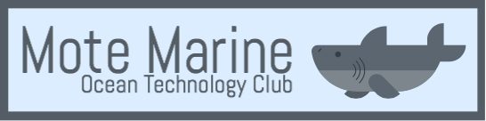

# Ocean-Technology-Club



> Ocean technology club where Sarasota county high schoolers learn and apply science and technology skills through the mentorship of marine researchers at Mote.

## Table of Contents

- [Background](#background)
- [Install](#install)
- [Usage](#usage)
- [Contribute](#contribute)
- [License](#license)

## Background
OTC is a program that allows Sarasota and Manatee-county high schoolers
and teachers to learn and apply science and technology skills through the
mentorship of marine researchers at Mote.

The selected student and teacher members explore oceanography, physics,
chemistry, electronic circuitry and computer programming through real-world
examples and applications — from deploying monitoring devices in local
environments to working closely with Mote scientists using robotic gliders to
monitor for harmful algae.

## Install

```
git clone https://github.com/MoteMarine/Ocean-Technology-Club.git
```

Follow the instructions found in the `docs` directory.

## Usage

After building the sensor described in the documentation you'll have a fully functioning,
field-ready device. Point the Arduino to send its measurements to wherever you see fit, and
you'll be left with real-time data in an easily consumable JSON format.

## Contribute

Feel free to dive in! Open an issue or submit PRs.
We're open to all ideas and suggestions. We want to teach the best curriculum we can,
and we hope the open source community can help us do that.

## License

MIT © Mote Marine Laboratory
